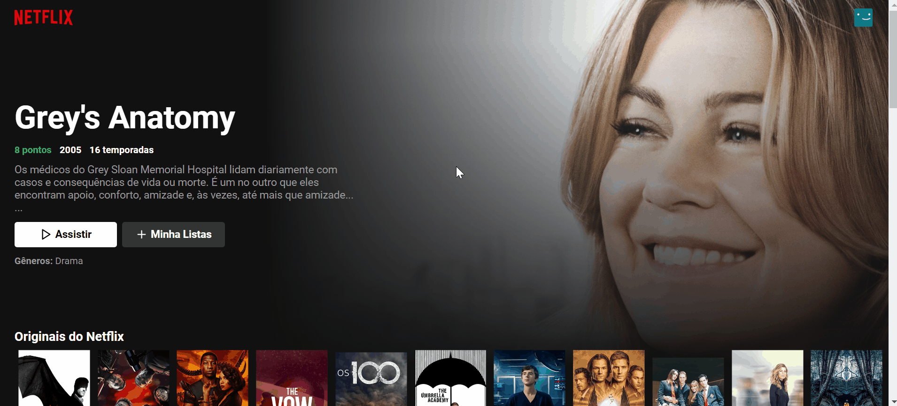

<h1 align="center">
 
 Clone do Netflix
  
</h1>
  
 
Este site é um clone do netflix para fins de prática e estudo.  Todo direito de imagem pertencem a Netflix.

## 1º Funcionalidade - Animação Barra do Topo

mudança gradual da barra no top do site, que é apresentada  após fazer um leve scroll para baixo

## 2º Funcionalidade - Animação dos elementos do Site

Destaque gradual nos botões e nas imagens de filmes e sérias. Ocorre gradualmente um destaque nas imagens  ao passar o mouse por cima e volta gradualmente a posição anterior ao retirar o mouse da imagem

## 3º Funcionalidade - Animação na movimentação dos conteúdos

Movimentação para esquerda e para direita na capa dos conteúdos,  para que possa ver mais filmes/series relacionadas ao tópico selecionado.

## 4º Funcionalidade - Tela de Loading(carregamento) clássica do Netflix

Uma tela de carregamento é apresentada ao entrar no site pela primeira vez  ou quando é atualizada a página.

